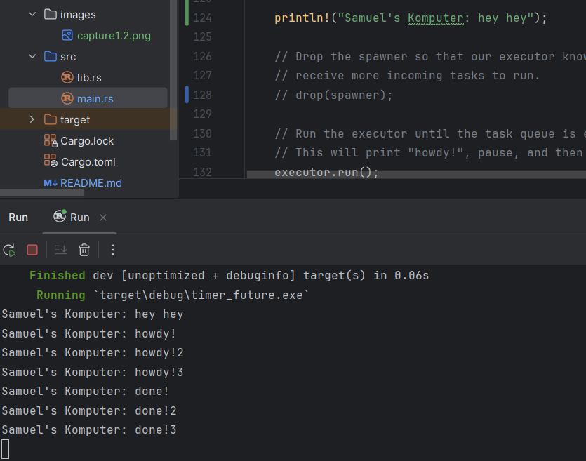
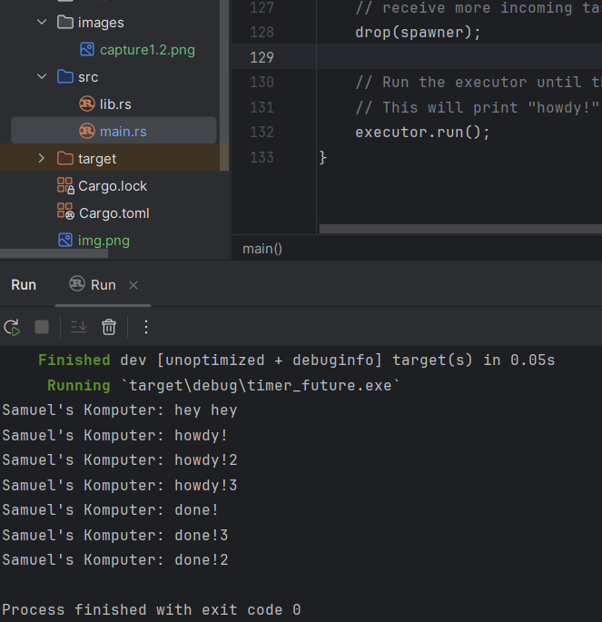

# timer_future_tut10

Nama: Samuel Taniel Mulyadi

NPM : 2206081805

**Experiment 1.2: Understanding how it works.**

> Screenshoot

The output "Samuel's Komputer: hey hey" is printed before the task is spawned because it's part of the main function and executed immediately. Then, the task is spawned asynchronously to print "Samuel's Komputer: howdy!" and wait for the timer future to complete, which is 2 seconds. 

The execution of the spawned task and the main function runs concurrently, but the main function doesn't wait for the spawned task to complete. This is why "howdy!" and "done!" are printed in between the initial and final print statements, meanwhile the main function which print "hey hey" immediately printed first.

In essence, the asynchronous nature of spawning tasks allows the main function to continue its execution while the spawned task operates independently. Thus, the order of printing reflects the concurrent execution of tasks rather than a sequential flow.

**Experiment 1.3: Multiple Spawn and removing drop**
> Picture 1

> Picture 2

Pay your attention to the second image, with the line that says "Process finished with exit code E", while the first picture still continue to run.

If the line drop(spawner); is omitted, the program will continue running indefinitely. This is because the Executor's run method remains active, continuously awaiting tasks to be dispatched through the ready_queue. As the spawner persists, it continues dispatching tasks without cessation, causing none of them to reach completion.

The drop(spawner); instruction holds significance as it signifies the conclusion of task generation. When the spawner is dropped, it effectively closes the transmission end of the channel, signaling that no further tasks will be dispatched. Consequently, the Executor proceeds to exhaust all tasks within the ready_queue, thereby concluding its run method upon the absence of pending tasks.

In the absence of drop(spawner);, the Executor remains trapped within its run method, perpetually anticipating additional tasks. As a result, the program persists without termination, lacking a directive to cease waiting for new tasks.